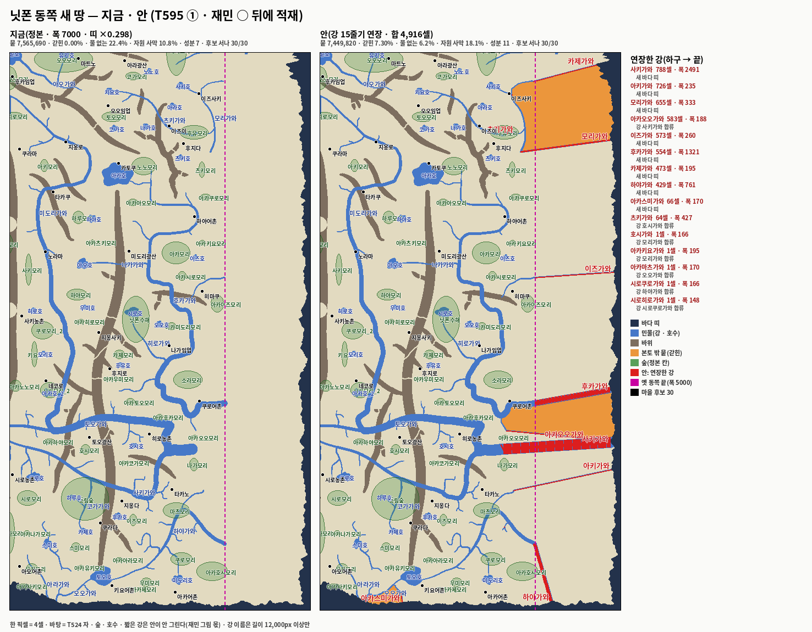

# T595 — 닛폰 7000 뒤 남은 것: 동쪽 안 그림 · 다리 −131 · 띠를 보는 자잘 광맥 계획기 · 시딩 상한 30 (세션5 · 2026-10-03 · 가지만 · `[승인 대기 · T595]`)

**한 줄 답:** 다리 131셀을 걷고(547 → 416) 닛폰 `villageMax` 30을 넣었다. 자잘 광맥 계획기는 이제 해안 띠를 본다.

| 항목 | 값 |
|---|---|
| ① 동쪽 안 그림 | `산그림/T595_닛폰_동쪽.png`(지금 · 안 나란히) · 작업 파일 `~/Mini/_terrain/nippon_동쪽안.json`(마을 30 · 세계 · 존 두 보기) — **적재 0**(재민 ○ 뒤) |
| ② 다리 | **547 → 416셀**(−131 = 남해안 45 + 남동 74 + C 12) · 지금 판 본토 한 덩이 · 갇힌 0.00% · 도달 276/276 |
| ③ 띠 거른 504 | 띠 위 **37 → 0** · p95 **189**(한반도 127) — 504로는 안 닿는다 · 127 최소 = **지금 판 1,100 · 안 판 1,000**(§③ · 적재 0) |
| ④ 시딩 | 상한 30 → **24/30**이 선다 · 떨어지는 6곳 = 간격 5(12,000px) + 식량 하한 1(지옹사키) · 전수(`seedAllVillages`)면 **30/30 · 435/435쌍** — 판정 자리 |
| ⑤ 3시드 | **동일** — 여섯 JSON `cmp` 같음 · `t408-seam-gate` 바뀐 청크 0(닛폰 포함) |

- 가지 `batch/nippon-after-width-1003`, 베이스 `a44e559`(main).
- 게이트:

  | 자 | 결과 |
  |---|---|
  | 한반도 3시드(1020 · 7 · 42 · 800일 · t17 + t176) | **동일** — 여섯 JSON `cmp` 같음(main `a44e559` 대비) · 8,205 / 7,968 / 7,924 · 산 마을 51/51 |
  | `t408-seam-gate`(한반도 · 닛폰 · 중원북 전 청크) | 바뀐 청크 **0 · 0 · 0** · 경계 셀 술어 뒤집힘 0 — 다리 칸과 시딩 상한은 청크 산출에 안 닿는다 |
  | `test-nippon-boot` | **42/0**(ⓘ2 · ⓘ3 새 수 24 · 276) |
  | `test-jungwon-boot` | **38/0**(ⓗ3 416) |
  | `test-seam` | **8/0** |
  | `e2e-zone-cross` | **46/0** |
  | `e2e-xzone-caravan` | **26/0**(T591 때 흔들리던 ⓓ4 도 이번 판은 초록) |
  | `test-map-editor` | **41/0** |
  | `editor-baked-check` | 다리 nippon 547 → 416 이라 다르다고 나와 `--write` 했다 → 같다(`f985/m2504/a281a84415`). **PM: 맥 사본 굽기**(`node scripts/build-map-editor.js ~/Mini/map-editor.html`) |
  | lint | 60/61(main `a44e559` 도 60/61 · `e2e-mtcut.js` 남의 줄) |

- T588(세션8) · T574 추신4 굽기 무접촉 — `chunk.js` · 해안 꼴 · 광종 칸 · `hanbando-terrain.json` 한 바이트도 안 바꿨다.

---

## ① 동쪽 채우기 — 그림만(적재 0)

- 그림: `산그림/T595_닛폰_동쪽.png`(맥) = `문서/T595_닛폰_동쪽.png`(레포)

- 안 = T591의 `t591-east.py` 그대로다. 지금 정본(군락 43 포함) 위에 다시 돌렸다 — 강 칸은 T591 안과 같다.
  - 옛 판(폭 5000)에서 하구가 띠에 닿았고 새 판에서 안 닿는 강 15줄기를 곧게 늘인다(T550 ②ⓒ 문법 · 새 바다 띠 +2셀 · 길에 다른 강이 먼저 닿으면 합류 · 폭 = 하구 폭).
  - 합 4,916셀. 긴 것: 사키가와 788 · 아키가와 726 · 모리가와 655 · 아카오오가와 583(사키가와 합류) · 이즈가와 573 · 후카가와 554 · 카제가와 473 · 하야가와 429.
  - 숲 · 호수 · 짧은 강은 **안 그렸다**(재민 그림 몫). 그림에는 지금 정본의 숲 · 호수 이름을 얹었다.
- T524 자(다리 416 판):

  | 판 | 뭍 | 갇힌 | 물 없는 | 자원 사막 | 성분 | 민물 p95 | 광맥 p95 | 후보 서나 |
  |---|---:|---:|---:|---:|---:|---:|---:|---:|
  | 지금 | 7,565,690 | 0.00% | **22.4%** | 10.8% | 7 | 645 | 1,518 | 30/30 |
  | 안 | 7,449,820 | **7.30%** | **6.2%** | 18.1% | 11 | 329 | 1,477 | 30/30 |
  | 한반도 | 7,300,094 | | | | | 300 | 127* | |

  *한반도 광맥 p95 127은 자잘 724 포함. 닛폰 표의 광맥 p95는 자잘 0 판이다.
- **안의 갇힌 땅 셋**(본토 밖 뭍 · 그림 주황):

  | 덩이 | 셀 | 자리(셀) | 가두는 강 | T591 안(다리 547)에서 |
  |---|---:|---|---|---|
  | 북동 | 335,614 | x 1393~2137 · y 92~716 | 카제가와 · 모리가와 | 갇힘 |
  | **중동** | **188,873** | x 1318~2142 · y 2475~2809 | 후카가와 · 사키가와 | **본토** — C 다리(12셀)가 이었다 |
  | 남서 | 19,480 | x 340~594 · y 3877~4021 | 아카스미가와 | 갇힘 |

  - 갇힌 % 가 T591 4.77% → 7.30%인 까닭은 중동 덩이 하나다. ② 에서 걷은 C 다리가 안에서는 그 덩이를 잇고 있었다.
  - 지금 판에서는 C 다리가 할 일이 없다(덩이 C가 다리 없이 본토). 안이 들어가면 그 다리 한 판(계획기 v2 · `T580_EMPTY_MIN`)에서 다시 놓인다 — 카드 순서 그대로다.
- 작업 파일 `~/Mini/_terrain/nippon_동쪽안.json`: `export-editor-work.js`(`EW_ZONE=nippon`)로 뽑았다.
  - 스탬프 `f309/m2504/d0a4a90a5d`. 존 보기(features 309 · 마을 30)와 세계 보기(mf 2504 · 닛폰 마을 30 포함) 둘 다 마을이 있다.
  - 에디터 「작업 불러오기」로 연다. 고친 것은 재민 ○ 뒤에 정본으로 옮긴다.

## ② 다리 걷기 — 547 → 416

| 무리 | 셀 | 자리(셀) | 밑 | 까닭 |
|---|---:|---|---|---|
| T550 남해안 | 45 | x 612~626 · y 3849~3853 | 전부 뭍(물 0) | 띠가 물러나 밑이 뭍 |
| T550 남동 | 74 | x 1364~1383 · y 3882~3885 | 전부 뭍(물 0) | 같다 |
| T580 C | 12 | x 1314~1319 · y 2662~2663 | 물 9셀 | 덩이 C가 다리 없이 본토에 붙었다 |
| 합 | **131** | | | |

- 다리 셀을 8이웃으로 묶어 16무리 · 정본 지형(T524 자 셀 종류)으로 무리마다 밑의 물을 셌다. 물 0인 무리는 위 둘뿐이다.
- 남은 13무리(416셀)는 그대로 물을 건넌다.
- 걷은 뒤(T524): 본토 한 덩이 · 갇힌 0.00% · 성분 7(다리 547 판과 같다). 부팅 실측: 교역 BFS `다리구제 34` · 도달 276/276 · 불능 0.
- `test-jungwon-boot` ⓗ3 = 416. 사유 한 줄: "547 − T595 ② 뭍 위에 남은 131 · 폭 7000으로 띠가 물러나 밑이 뭍이 됐다".
- 번들 · 랩 재생성(`build-econ-bundle` · `inline-engine` — zone-config 내장 칸) · `editor-baked-check --write`.

## ③ 자잘 광맥 계획기가 띠를 본다

- `plan-ore-clusters.js`의 4셀 표본 물 판정 = **해안 띠 ∪ 강 · 호수**. `plan-bridges-v2.js`의 그 줄(`generateCoastlineWaterTiles` + `isWaterCellLocal`)과 같다. 새 규칙 0.
  - 끔 `T595_BAND=0`이면 강 · 호수만 본다 = 종전 계획 바이트 그대로.
  - 한반도 정본 광맥은 다시 안 돌렸다(한 바이트도 무변). 다음에 한반도에서 계획기를 돌리면 띠 위 자리가 빠진다(한반도 자잘 724 중 띠 위 35 · 4.8% — T586 표).
- 자잘 504 다시(따로 만든 worktree · 이 가지 정본 · 광종 칸 비움 · T524):

  | 판 | 띠 위 | 동쪽 새 땅(x ≥ 1,562셀)에 | p50 | p90 | **p95** | p99 |
  |---|---:|---:|---:|---:|---:|---:|
  | 끔(종전 계획기) | 37(7.3%) | 264 | 64 | 155 | 187 | 253 |
  | **켬** | **0** | 271 | 68 | 161 | **189** | 251 |
  | 한반도(자잘 724) | 35(4.8%) | | 50 | 107 | 127 | 183 |

  - 띠 위 몫이 T586의 28% → 7.3%로 이미 준 것은 띠 배수 0.298(T591) 덕이다. 계획기를 고치니 0이 됐다.
  - p95 차이(+2)는 띠 위 37개가 뭍으로 옮겨 앉으며 생긴 자리 흔들림이다. 띠 위 광맥은 아무도 못 캐니 켬 판이 실제 값이다.
- **504로는 127에 안 닿는다.** 최소 수 표(켬):

  | 자잘 | 지금 판 p95 | 안 판 p95 |
  |---:|---:|---:|
  | 504 | 189 | 184 |
  | 750 | 159 | |
  | 900 | | 134 |
  | 950 | | 128 |
  | **1,000** | 135 | **123** |
  | 1,050 | 129 | |
  | **1,100** | **126** | |
  | 1,150 | 124 | |
  | 1,300 | 114 | |

  - 127에 닿는 최소: **지금 판 1,100**(1,050은 129) · **안 판 1,000**(950은 128). 50개 걸음으로 잰 값이다.
  - 왜 이렇게 많이 드나: 계획기는 소외(물 · 숲 180셀 밖) 구역에 할당을 2.5배 준다. 넓힌 동쪽 땅은 통째로 소외라 **자잘의 54%(504 중 271)가 뭍의 30%인 동쪽 띠에 몰린다**. 그런데도 대 · 중 · 소 55가 전부 옛 땅에 있어 p95가 크다.
  - 그러니 수는 동쪽 땅 꼴(① 안 · 재민 그림 · T588 해안 꼴)과 대 · 중 · 소 굽기(T574 추신4)가 정해진 뒤 다시 재는 게 맞다. 적재는 카드대로 해안 꼴 뒤다 — 이 카드에서는 계획기 고침과 표까지만.
- 적재 명령은 그대로 한 줄이다: `node scripts/t586-minor-ores.js --count <수> --apply`(광종 칸 비움 · `t580-bake-nippon.js`가 굽는다).

## ④ 시딩 상한 30

- `nippon.villageMax: 30`(T586 추신 · 후보 수 30 = 51 × 닛폰 뭍 / 한반도 뭍 · 유도).
- 부팅 실측(이 가지 정본):

  | 갈래 | 선별 | 시딩 | 교역 쌍 | 도달 | 불능 |
  |---|---:|---:|---:|---:|---:|
  | 상한 20(main) | 20 | 20 | 190 | | |
  | **상한 30 · 품질 게이트** | 24 | **24** | 276 | 276 | 0 |
  | 전수(`SEED_ALL=1` = 한반도 `seedAllVillages` 길) | 30 | **30** | **435** | **435** | 0 |

- 상한 30에서 떨어지는 6곳 — **다섯은 간격**(`_seedSpacingPx` 12,000px), **지옹사키 하나는 식량 하한**이다(교역 잠재 K 0.278025 를 더해도 2.0 미만 · 하한 통과 29/30 — 정본 `pickSeedVillages` `_scoredOut` · `t559-gate-by-zone` 자식 꼴):

  | 마을 | 셀 | 가장 가까운 시딩 마을 | 거리 |
  |---|---|---|---:|
  | 후지다 | (1262, 661) | 이즈이 | 5,203px |
  | 지옹다 | (813, 3265) | 쿠라다 | 7,151px |
  | 지옹사키 | (648, 2039) | 후지로 | 8,778px — ★식량 하한 미달(F 0.27 · W 0.08)이 먼저 |
  | 이즈사키 | (1374, 299) | 이즈이 | 10,261px |
  | 아라광산 | (835, 56) | 마트노 | 10,760px |
  | 지옹로 | (408, 652) | 쿠라마 | 10,934px |

- ★판정 자리 하나: **30/30을 원하면 `seedAllVillages: true` 한 줄**이다. 한반도가 쓰는 정본 길이다(게이트 우회 · 51곳 전수).
  - 후보 30은 이미 "한반도와 같은 밀도"로 뽑은 수라, 간격 게이트가 다시 솎으면 밀도가 한반도의 80%가 된다.
  - 다만 전수면 식량 하한 미달인 지옹사키(F 0.27 · W 0.08 · 광맥 2.34)도 선다. 한반도 전수도 같은 처지의 자리를 품고 있다(T436: 하한 미달 9곳이 800일 3시드 전부 살았다 · 교역으로 먹는다).
  - 이 카드는 상한만 넣었다(새 판정 0). `test-nippon-boot` ⓘ2 · ⓘ3은 존 설정을 읽는다 — 그 줄을 켜면 30 · 435를 기대한다(실측 확인함).

## 자

- `scripts/t595-east-png.py` — ① 그림(T524 바탕 + 정본 칸 이름 + 안 연장 줄기 빨강 + 옛 동쪽 끝 점선).
- 계측은 레포 밖: 다리 무리 셈(8이웃 묶음 × T524 셀 종류) · 자잘 시험(`t586-minor-ores --count N --apply` → T524) · 시딩(`test-nippon-boot` 부팅 로그).

## PM 몫

1. ① 그림을 재민에게 — ○면 안을 정본에 얹고(강 15 연장), 갇힌 셋 다리 한 판(v2 · `T580_EMPTY_MIN`).
2. ④ `seedAllVillages` 를 켤지(30/30 · 435) — 지금은 24/30.
3. ③ 자잘 수 — 동쪽 꼴 · T588 · T574 추신4 뒤에 다시 잰다(지금 판 최소 1,100 · 안 판 1,000).
4. 맥 에디터 사본 굽기(다리 416).
