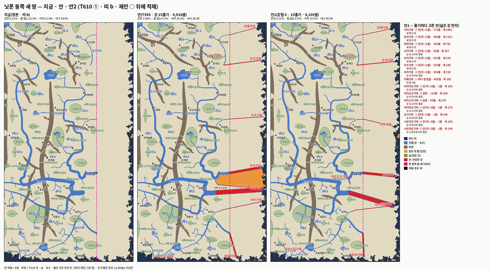

# T610 — 닛폰 동쪽 안2 · 자잘 광맥 수 유도 · 시딩 전수 30 (세션5 · 2026-10-03 · 가지만 · `[승인 대기 · T610]` · 정본 무변)

**한 줄 답:** 안2는 안이 만든 갇힌 덩이를 **2.68% → 0**으로 만든다. 물 없는 땅 6.9% · 자원 사막 13.9%다. 광맥 수는 지금 판 **1,000** · 안2 판 **950**이다. 전수 시딩은 **30/30**이 서고, 영토 겹침은 **1쌍**이다.

- 띠는 전부 `T588_COAST=b`로 쟀다(T604 추신3 확정 · 닛폰 이동 값은 아직 없음 = 0). T595 수(띠 기본)와 그래서 조금 다르다.
- 정본 무변이다: `server/*.json` · `zone-config.js` 한 바이트도 안 바꿨다. 그래서 3시드는 main 바이트 그대로다(다시 돌리지 않았다).
- 산출은 작업 파일과 그림뿐이다:

  | 파일(맥) | 무엇 |
  |---|---|
  | `산그림/T610_닛폰_동쪽안2.png` = `문서/T610_닛폰_동쪽안2.png` | 지금 · 안 · 안2 세 칸(T595 그림과 같은 틀) |
  | `_terrain/nippon_동쪽안2.json` | 안2 에디터 작업 파일(스탬프 `f309/m2504/7d03c0727a` · 마을 30 존 · 세계 두 보기) |
  | `_terrain/nippon_광맥_지금.json` | 지금 지형 + 자잘 1,000(광종 칸 비움) — 닛폰 존 절 꼴(`T549_PLAN`으로 바로 얹힌다) |
  | `_terrain/nippon_광맥_안2.json` | 안2 지형 + 자잘 950(같다) |

- 게이트:

  | 자 | 결과 |
  |---|---|
  | `test-nippon-boot` 기본 | **42/0** |
  | `test-nippon-boot` `T588_COAST=b` · 게이트 | **42/0** · 24곳 · 276/276 |
  | `test-nippon-boot` `T588_COAST=b` · `SEED_ALL=1` | **42/0** · **30곳 · 435/435** · 불능 0 |
  | `test-seam` | **8/0** |
  | lint | 60/61(main 같음 · `e2e-mtcut.js` 남의 줄) |
  | 3시드 | 정본 무변 → main 바이트 그대로 |

---

## ① 동쪽 안2 — 갇힘 0

- 규칙(`scripts/t610-east2.py`): 같은 15줄기 · 같은 문법(하구에서 곧게 · 폭 = 하구 폭). 줄기마다 **갇힌 덩이를 안 늘리는 첫 안**을 고른다.
  - ⓐ 안 그대로(가장 가까운 띠 + 2셀 · 길에서 다른 강을 만나면 합류)
  - ⓑ 합류 — 가장 가까운 **제 폭 이상** 강으로(큰 강이 작은 강으로 들지 않는다 · 띠를 안 지나는 길만)
  - ⓒ 바다 앞 멈춤 — 끝이 띠에서 반폭 + 2셀 바로 밖(끝과 바다 사이 뭍 길)
  - ⓓ 빼기
  - 넓은 강부터 고른다. 처음엔 T595 표 순서로 했더니 사키가와(폭 2,491)가 지류 아카오오가와로 들어가 바다에 못 닿았다. 그래서 순서를 바꾸고 ⓑ에 폭 조건을 걸었다.
  - 갇힘 = 본토와 4이웃으로 안 이어지는 **1,000셀 이상** 덩이(`t549-terrain-check` 이름 문턱). 새 수 0.
- 고른 것:

  | 줄기 | 폭 | 안2 | 셀 | T595 안 |
  |---|---:|---|---:|---:|
  | 사키가와 | 2,491 | ⓐ 새 바다 띠 | 772 | 788 |
  | 후카가와 | 1,321 | ⓐ 새 바다 띠 | 540 | 554 |
  | 하야가와 | 761 | ⓐ 새 바다 띠 | 392 | 429 |
  | 츠키가와 | 427 | ⓐ 호시가와 합류 | 63 | 64 |
  | 모리가와 | 333 | ⓐ 새 바다 띠 | 632 | 655 |
  | 이즈가와 | 260 | ⓐ 새 바다 띠 | 514 | 573 |
  | 아키가와 | 235 | ⓐ 사키가와 합류 | 559 | 726(바다) |
  | **카제가와** | 195 | **ⓒ 바다 앞 6셀에서 멈춤** | 463 | 473 |
  | **아카오오가와** | 188 | **ⓑ 후카가와 합류** | 115 | 583(사키가와 합류) |
  | **아카스미가와** | 170 | **ⓑ 오오가와 합류** | 84 | 66(바다) |
  | 나머지 다섯(1셀 합류) | | ⓐ 그대로 | 1씩 | 1씩 |
  | 합 | | | **4,139** | 4,916 |

  - T595 안의 갇힌 덩이(중동 191,381셀)는 아카오오가와 583셀 줄기가 사키가와까지 가로질러 막았던 것이다. 안2에서는 그 줄기가 115셀만 가서 후카가와에 든다.
  - 카제가와 하나만 바다에 안 닿는다(하구가 띠 앞 6셀). 재민 눈이 볼 자리다 — 싫으면 그 줄기만 빼면(ⓓ) 지금처럼 막다른 하구다.
- T524 자(띠 b · 다리 416):

  | 판 | 뭍 | 갇힌 % | 그중 1,000셀 이상 덩이 | 물 없는 % | 자원 사막 % | 성분 | 후보 서나 |
  |---|---:|---:|---|---:|---:|---:|---:|
  | 지금 | 7,571,053 | 0.11 | 섬 둘(1,972 · 1,244) | 22.5 | 11.0 | 62 | 30/30 |
  | 안(T595) | 7,454,024 | **2.68** | **중동 191,381** + 섬 둘 | 6.3 | 18.0 | 63 | 30/30 |
  | **안2** | 7,461,616 | 0.12 | 섬 둘(같은 둘) | **6.9** | **13.9** | 63 | 30/30 |

  - 지금 판의 0.11%(8,424셀 · 61덩이)는 띠 b가 만든 바닷가 섬이다(T588 생성기 몫 · 안과 무관).
  - 안2는 거기에 632셀 더 갇힌다 — 1,000셀 아래 부스러기(강 칸 가장자리와 띠 사이). 안이 만든 이름 붙는 덩이는 0이다.
  - 자원 사막이 안2에서도 지금보다 높은 까닭: 사막 = 숲 · 광맥 · 바위 **걸음 거리**가 한반도 p95 밖인 뭍이다. 새 강이 걸음을 돌아가게 해서 숲까지 멀어진다(숲 걸음 p95 882 → 1,212). 동쪽에 숲을 그리면(재민 그림 몫) 내려간다.
- 띠 b에서는 T595 안의 북동 덩이(띠 기본 판 335,614셀)가 생기지 않는다. 해안 꼴이 바뀌면 덩이도 바뀐다 — 그래서 안2는 띠 b 위에서 뽑았다.

## ② 자잘 광맥 수 — 한반도 p95 127 을 내는 가장 작은 수

- 계획기 = T595 고친 판(띠 ∪ 강 · 호수 · `T588_COAST=b` 띠를 그대로 본다) · 적재기 `t586-minor-ores --count N`(광종 칸 비움) · 자 T524(띠 b). 50개 걸음.

  | 자잘 | 지금 판 p95 | 안2 판 p95 |
  |---:|---:|---:|
  | 850 | | 133 |
  | 900 | | 129 |
  | **950** | 128 | **126** |
  | **1,000** | **125** | 120 |
  | 1,050 | 122 | |
  | 1,100 | 121 | |
  | 1,150 | 119 | |

- **지금 판 1,000 · 안2 판 950.** 띠 위 0(두 판 다) · 동쪽 새 땅(x ≥ 1,562셀)에 521 · 431.
  - T595(띠 기본)는 지금 판 1,100이었다. 띠 b가 동쪽 띠를 다르게 깎아 50 줄었다.
- 작업 파일 두 개에 그 수로 놓은 판이 들어 있다. 적재(T601 굽기) 한 줄: `T588_COAST=b node scripts/t586-minor-ores.js --count <1000|950> --apply`(지형을 먼저 굽고) — 같은 계획기 · 같은 수면 같은 자리다(결정론).
- 대 · 중 · 소가 T574 추신4로 다시 구워지면 수가 바뀐다 — 그때 같은 표를 다시 잰다.

## ③ 시딩 전수 30

- `SEED_ALL=1`(= `seedAllVillages` 갈래) · 띠 b 부팅: **30/30이 선다** · 교역 435/435 · 불능 0.
- 떨어지던 6곳이 서는 자리(부팅 `시딩: 중심 셀` 줄):

  | 마을 | 꼴 | 후보 셀 | 선 셀 | 게이트에서 떨어진 까닭 | 땅(F/W/S/O/우드) |
  |---|---|---|---|---|---|
  | 이즈사키 | plain | (1374, 298) | (1374, 299) | 간격 — 이즈이 10,261px | 1.14/1.58/0.25/0.1/0.45 |
  | 지옹로 | riverside | (408, 652) | 그대로 | 간격 — 쿠라마 10,729px | 1.10/1.58/0.25/0.1/0.45 |
  | 지옹다 | mining | (813, 3265) | 그대로 | 간격 — 쿠라다 7,151px | 0.74/0.75/2.1/2.5/0.51 |
  | 후지다 | plain | (1262, 661) | 그대로 | 간격 — 이즈이 5,203px | 0.69/0.82/0.74/0.1/0.86 |
  | 지옹사키 | mining | (648, 2039) | 그대로 | **식량 하한**(간격 안이기도 — 후지로 8,778px) | 0.27/0.08/2.5/2.34/0.45 |
  | 아라광산 | mining | (835, 56) | 그대로 | 간격 — 마트노 10,760px | 0.29/0.08/1.07/0.54/0.57 |

- **영토 겹침 쌍** — T596 계획기 `plan-villages-reset.js --zones nippon`(재기만 · 적재 0 · 띠 b):
  - 전수 30곳 안 **1쌍**: 후지다 ↔ 이즈이(162.6셀 < 필요 200셀 = 영토 반경 89 + 111).
  - 게이트 24곳 안에는 0쌍이다(후지다가 빠지니).
  - 계획기가 내는 해법: 후지다를 (1280, 693)으로 36.7셀 옮긴다(땅 3.882 → 3.892). 남은 겹침 0.
  - 반경은 한반도 3시드 끝 인구의 꼴별 최대에서 온다(닛폰 자 판이 없다 — 계획기 규칙). 인구 파일은 T595 게이트 판(main `a44e559` · 8,205 / 7,968 / 7,924)을 썼다. 지금 main 기준선(개울 낀 판)으로 다시 돌리면 반경이 조금 바뀔 수 있다.
  - 같은 판에서 계획기는 겹침과 무관하게 마당 · 중심 어김 10곳도 옮긴다(최대 20셀 · 노라마). 그건 T596 몫이라 표만 둔다.
- 정본에 `seedAllVillages: true`를 넣는 일은 이 카드 밖이다(정본 무변). 넣으면 `test-nippon-boot` ⓘ2 · ⓘ3이 30 · 435를 기대한다(T595에서 존 설정을 읽게 해 뒀다).

## 자

- `scripts/t610-east2.py` — 안2(줄기마다 ⓐ → ⓑ → ⓒ → ⓓ · 래스터 갇힘 셈).
- `scripts/t610-east2-png.py` — 세 칸 그림(`t595-east-png.py` 틀).
- 계측은 레포 밖: T524 자(`T588_COAST=b`) · 자잘 시험(worktree에서 `t586-minor-ores` → T524) · 시딩 부팅(`test-nippon-boot` 로그).

## PM 몫

1. 안2 그림을 재민에게 — 특히 카제가와(바다 앞 멈춤) 하나.
2. ○면 T601 굽기 차례: 안2 지형 → 자잘 950 → 다리(안2는 갇힌 덩이가 0이라 더할 다리가 없을 것이다 — 굽은 뒤 계획기 v2로 다시 잰다) → 개울.
3. `seedAllVillages`를 정본에 넣을 때 후지다 옮김(T596)을 같이.
