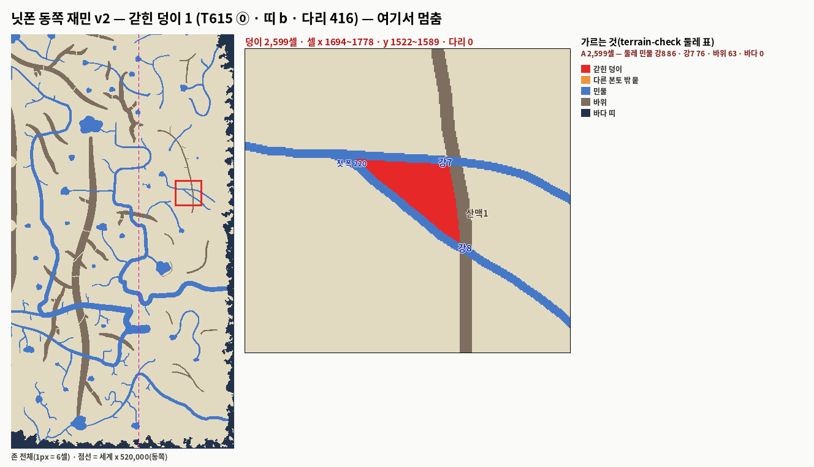

# T615 — 닛폰 동쪽 재민 지형 v2 ⓪ 검사표 — **갇힌 덩이 1(2,599셀 · 강7 · 강8 · 산맥1)이라 ⓪에서 멈춤** (세션5 · 2026-10-03 · 가지만 · `[승인 대기 · T615]` · 정본 무변)

**한 줄 답:** 갇힘 **0.035%**(새 덩이 하나 · 2,599셀) · 물 없음 **2.7%**(동쪽 6.0%) · 사막 **1.3%**(동쪽 2.9%) · 광장에서 도달 99.85% · 후보 30 다 섬 · 더한 지류 0 · 계곡 0 · 고개 0 · 숲 0 — 카드대로 **①은 하지 않았다**. T616도 이 판 위라 시작하지 않았다(재민 손질본이 오면 그 위에서).

- 바탕: 맥 `_terrain/editor-work_재민_v2.json` → 닛폰 존 절 안(`scripts/t615-make-plan.py` = `t550-make-plan.py` 그대로 + 존 사각을 zone-config 에서 · 닛폰 7000).
  - 내장판(`lab/map-editor-baked.json`)과 견줘 닛폰에 닿는 것만 얹었다: 새 강 11(강2~12 · 강1은 한반도 안) · 산맥 14 · 호수 8 · 숲 16 · 손댄 옛 것 6(하야가와 · 후카가와 · 아라가와 · 오오가와 · 유키모리 · 아카사키모리) · 지운 옛 강 1(쿠로가와).
  - ★작업 파일에는 **닛폰 밖 손질도 섞여 있다**(한반도 한여울강 · 흰숲천 · 한들천 · 숯골 · 어촌6 · 새 강1 · 지운 솔여울 · 미르내 · 가랑천 · 노루내 · 중원북 둔머리천). 이 카드 밖이라 안 얹었다 — 다른 카드(T614?) 것인지 PM이 본다.
- 자: T524(`T588_COAST=b` · 닛폰 이동 0 · 다리 416) · `t549-summary` · `t549-terrain-check`. T595 · T610 과 같은 자 · 같은 표 틀.

## ⓪ 검사표

| 판 | 뭍 | 갇힌(1,000셀 이상 · 섬 둘 뺌) | 물 없는 % | 자원 사막 % | 광장에서 도달 % | 후보 서나 |
|---|---:|---|---:|---:|---:|---:|
| 지금(정본) 전체 | 7,571,053 | 0 | 22.5 | 11.0 | 99.89 | 30/30 |
| 지금 · 동(세계 x ≥ 520,000) | 3,441,417 | 0 | 49.5 | 23.9 | 99.77 | |
| **재민 v2** 전체 | 7,440,477 | **1덩이 2,599셀(0.035%)** | **2.7** | **1.3** | 99.85 | 30/30 |
| **재민 v2 · 동** | 3,310,817 | 같은 1덩이(0.079%) | **6.0** | **2.9** | 99.68 | |
| 재민 v2 · 서 | 4,129,660 | 0 | 0.02 | 0.01 | 99.99 | |

- "섬 둘"(1,972 · 1,244셀)은 띠 b 바닷가 섬이다 — 지금 판에도 있다(T610). 그 밖의 1,000셀 아래 조각도 지금 판과 같은 꼴이다.
- 물 없는 땅 · 사막은 재민 지형이 거의 다 메웠다(동쪽 49.5 → 6.0 · 23.9 → 2.9). T610 안2(동 강 연장만)는 전체 6.9 · 13.9 였다.

### 갇힌 덩이 — 재민이 고칠 자리

| 덩이 | 셀 | 자리(셀) | 둘레 | 원인 |
|---|---:|---|---|---|
| A | 2,599 | x 1694~1778 · y 1522~1589(세계 x ≈ 534,200~536,900 · y ≈ 98,700~100,800) | 민물 강8 86 · 강7 76 · 바위 63 · 바다 0 | **강8이 강7에서 갈라져(발원 = 강7) 두 강이 산맥1 을 각각 고개 없이 자른다** — 강7 · 강8 · 산맥1 셋이 세모를 닫는다 |

- 고칠 길(재민 손 · 지금 규칙으로 되는 것만 적는다 — 적용 0):
  - 강8 발원을 강7 밖으로(호수 · 산맥에서 나게) — 세모가 열린다.
  - 산맥1 을 세모 안에서 끊거나 고개 하나.
  - (참고) ①의 협곡 규칙(T550 ②ⓒ — 강이 산맥 몸을 지나는 구간에 기슭 길)을 돌리면 강7 이 산맥1 을 지나는 자리에 길이 나 열릴 것으로 보인다. 카드가 ⓪ 갇힘이면 ①을 하지 말라고 해서 재지 않았다.

## 재민 줄마다 — `t549-terrain-check` 강 · 호수 · 산맥 표

| 강 | 길이(셀) | 폭 발원→하구 | 발원 | 하구 | 하류로 넓어짐 | 산맥 자름(고개 없이) | ✗ |
|---|---:|---|---|---|---:|---|---|
| 하야가와 | 1702 | 120→761 | 호수 · 토오호 | 바다 · 띠 0셀 | 1.0 | - | 0 |
| 후카가와 | 3554 | 120→1321 | 뭍 ·  | 바다 · 띠 0셀 | 1.0 | 미도리야마 37셀 | 2 |
| 아라가와 | 355 | 120→287 | 뭍 ·  | 바다 · 띠 1셀 | 1.0 | - | 1 |
| 오오가와 | 331 | 120→275 | 호수 · 토오호 | 바다 · 띠 1셀 | 1.0 | - | 0 |
| 강2 | 943 | 345→345 | 뭍 ·  | 바다 · 띠 0셀 | 1.0 | - | 1 |
| 강3 | 153 | 345→345 | 강 · 강2 | 호수 · 호수1 | 1.0 | - | 1 |
| 강4 | 109 | 345→345 | 강 · 강2 | 뭍 ·  | 1.0 | - | 2 |
| 강5 | 139 | 345→345 | 호수 · 호수4 | 강 · 후카가와 | 1.0 | - | 0 |
| 강6 | 311 | 220→220 | 호수 · 호수3 | 뭍 ·  | 1.0 | 산맥1 11셀 | 2 |
| 강7 | 581 | 220→220 | 호수 · 호수5 | 뭍 ·  | 1.0 | 산맥1 11셀 | 2 |
| 강8 | 318 | 220→220 | 강 · 강7 | 뭍 ·  | 1.0 | 산맥1 11셀 | 3 |
| 강9 | 844 | 280→280 | 호수 · 호수6 | 호수 · 호수7 | 1.0 | - | 0 |
| 강10 | 299 | 280→280 | 강 · 이즈가와 | 호수 · 호수2 | 1.0 | - | 1 |
| 강11 | 48 | 80→80 | 호수 · 이즈호 | 뭍 ·  | 1.0 | - | 1 |
| 강12 | 15 | 80→80 | 강 · 강11 | 뭍 ·  | 1.0 | - | 1 |

| 호수 | 반경(셀) | 드나드는 강 | 가장 가까운 산맥 | 바다까지 |
|---|---:|---|---|---:|
| 호수1 | 32 | 강3 | 산맥4 56셀 | 415 |
| 호수2 | 21 | 강10 | 산맥2 119셀 | 405 |
| 호수3 | 11 | 강6 | 산맥1 99셀 | 542 |
| 호수4 | 64 | 강5 | 산맥13 79셀 | 617 |
| 호수5 | 25 | 강7 | 산맥11 216셀 | 625 |
| 호수6 | 28 | 강9 | 산맥5 128셀 | 497 |
| 호수7 | 20 | 강9 | 산맥7 140셀 | 263 |
| 호수8 | 9 | - | 산맥10 84셀 | 264 |

| 산맥 | 길이(셀) | 폭 | 끝 닿음 |
|---|---:|---|---|
| 산맥1 | 894 | 345~345 | [None, None] |
| 산맥2 | 130 | 345~345 | [None, None] |
| 산맥3 | 160 | 345~345 | [None, None] |
| 산맥4 | 217 | 345~345 | ['산맥3', None] |
| 산맥5 | 128 | 345~345 | [None, None] |
| 산맥6 | 159 | 345~345 | [None, None] |
| 산맥7 | 399 | 345~345 | [None, None] |
| 산맥8 | 196 | 345~345 | ['산맥7', None] |
| 산맥9 | 53 | 80~80 | ['산맥1', None] |
| 산맥10 | 32 | 80~80 | ['산맥1', None] |
| 산맥11 | 44 | 80~80 | ['산맥1', None] |
| 산맥12 | 85 | 80~80 | ['산맥1', None] |
| 산맥13 | 199 | 80~80 | [None, None] |
| 산맥14 | 403 | 500~500 | [None, None] |

- ✗ 열 = 그 줄의 `t549-terrain-check` 깃발 수(막다른 하구 · 산에서 안 남 · 고개 없이 산맥 자름 · 해안 나란히).
- 새 강 11은 폭이 **처음과 끝이 같다**(345 · 220 · 280 · 80). 하구는 넓은 끝으로 고르는데 같으면 끝점이 하구가 된다 — 강4 · 강6 · 강7 · 강8 · 강11 · 강12 의 "막다른 하구 · 뭍"은 그 탓일 수 있다(그린 방향과 반대). 폭 규칙(T550 `t550-widths.py`)을 얹을 때 같이 풀린다.
- 해안 나란히 깃발은 0 이다. 산맥 9~12 는 산맥1 에 끝이 닿는 가지다(등뼈 꼴).

## 하지 않은 것

- ① 지류 · 계곡 · 고개 · 숲 — ⓪ 갇힘 1 이라 카드대로 멈춤.
- T616(마을 · 다리 · 광맥) — 바탕이 "T615 작업 파일(재민 ○ 뒤)"이라 시작하지 않았다.

## 자

- `scripts/t615-make-plan.py` — 에디터 작업 파일 → 존 절 안(닛폰에 닿는 것만).
- `scripts/t615-trap-png.py` — 갇힌 덩이 확대 + 존 전체 그림.
- 동/서 나눈 표는 레포 밖 셈(T524 bin · 셀 x 1,250 = 세계 520,000).

## PM 몫

1. 그림을 재민에게 — 강8 발원(또는 산맥1) 한 곳.
2. 재민 손질본이 오면 ⓪ 다시 → ① → T616.
3. 작업 파일의 닛폰 밖 손질(한반도 · 중원북)이 어느 카드 것인지.
