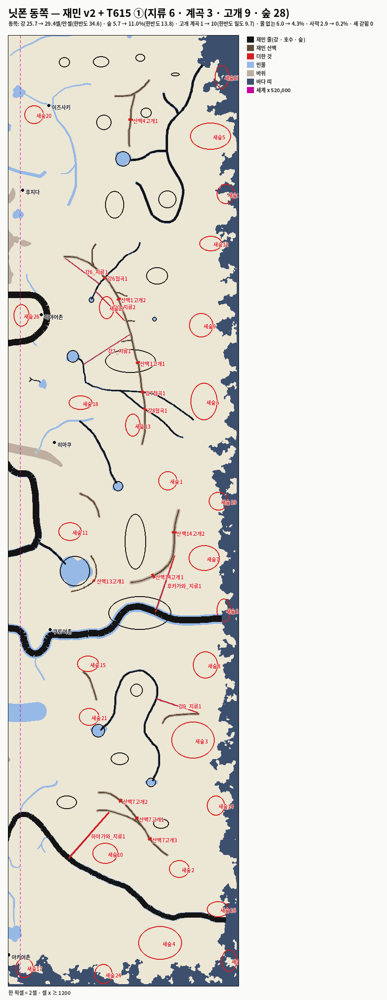

# T615 — 닛폰 동쪽 재민 지형 v2 · ⓪ 검사표 · ① 지류 · 계곡 · 고개 · 숲 (세션5 · 2026-10-03~04 · 가지만 · `[승인 대기 · T615]` · 정본 무변)

**한 줄 답:** 갇힘 **새 덩이 0**(⓪ 의 2,599셀 덩이는 ① 계곡이 풀었다) · 물 없음 동쪽 **6.0 → 4.3%** · 사막 동쪽 **2.9 → 0.2%** · 더한 지류 **6**(1,299셀 · 강 25.7 → 29.4셀/만셀 · 한반도 34.6 에 규칙 안에서 못 닿음) · 계곡 **3**(협곡) · 고개 **9**(고개 계곡 1 → 10 = 한반도 밀도) · 숲 **28**(5.7 → 11.0% · 한반도 13.8 에 규칙 안에서 못 닿음).

- ⓪ 첫 판(10-03)은 갇힌 덩이 하나로 멈췄다. ★T615 추신(PM · 10-04): 그 덩이는 동쪽 다리 0 탓 — 다리 대기로 두고 ① 진행 · 게이트 = ①이 **새** 갇힘을 안 만드는가.

- 바탕: 맥 `_terrain/editor-work_재민_v2.json` → 닛폰 존 절 안(`scripts/t615-make-plan.py` = `t550-make-plan.py` 그대로 + 존 사각을 zone-config 에서 · 닛폰 7000).
  - 내장판(`lab/map-editor-baked.json`)과 견줘 닛폰에 닿는 것만 얹었다: 새 강 11(강2~12 · 강1은 한반도 안) · 산맥 14 · 호수 8 · 숲 16 · 손댄 옛 것 6(하야가와 · 후카가와 · 아라가와 · 오오가와 · 유키모리 · 아카사키모리) · 지운 옛 강 1(쿠로가와).
  - ★작업 파일에는 **닛폰 밖 손질도 섞여 있다**(한반도 한여울강 · 흰숲천 · 한들천 · 숯골 · 어촌6 · 새 강1 · 지운 솔여울 · 미르내 · 가랑천 · 노루내 · 중원북 둔머리천). 이 카드 밖이라 안 얹었다 — 다른 카드(T614?) 것인지 PM이 본다.
- 자: T524(`T588_COAST=b` · 닛폰 이동 0 · 다리 416) · `t549-summary` · `t549-terrain-check`. T595 · T610 과 같은 자 · 같은 표 틀.

## ⓪ 검사표(10-03 · 재민 v2 그대로)

| 판 | 뭍 | 갇힌(1,000셀 이상 · 섬 둘 뺌) | 물 없는 % | 자원 사막 % | 광장에서 도달 % | 후보 서나 |
|---|---:|---|---:|---:|---:|---:|
| 지금(정본) 전체 | 7,571,053 | 0 | 22.5 | 11.0 | 99.89 | 30/30 |
| 지금 · 동(세계 x ≥ 520,000) | 3,441,417 | 0 | 49.5 | 23.9 | 99.77 | |
| **재민 v2** 전체 | 7,440,477 | **1덩이 2,599셀(0.035%)** | **2.7** | **1.3** | 99.85 | 30/30 |
| **재민 v2 · 동** | 3,310,817 | 같은 1덩이(0.079%) | **6.0** | **2.9** | 99.68 | |
| 재민 v2 · 서 | 4,129,660 | 0 | 0.02 | 0.01 | 99.99 | |

- "섬 둘"(1,972 · 1,244셀)은 띠 b 바닷가 섬이다 — 지금 판에도 있다(T610). 그 밖의 1,000셀 아래 조각도 지금 판과 같은 꼴이다.
- 물 없는 땅 · 사막은 재민 지형이 거의 다 메웠다(동쪽 49.5 → 6.0 · 23.9 → 2.9). T610 안2(동 강 연장만)는 전체 6.9 · 13.9 였다.

### 갇힌 덩이(10-03) — ★10-04: 다리 대기(추신) → ① 협곡이 풀었다(아래 ①)

| 덩이 | 셀 | 자리(셀) | 둘레 | 원인 |
|---|---:|---|---|---|
| A | 2,599 | x 1694~1778 · y 1522~1589(세계 x ≈ 534,200~536,900 · y ≈ 98,700~100,800) | 민물 강8 86 · 강7 76 · 바위 63 · 바다 0 | **강8이 강7에서 갈라져(발원 = 강7) 두 강이 산맥1 을 각각 고개 없이 자른다** — 강7 · 강8 · 산맥1 셋이 세모를 닫는다 |

- 고칠 길(재민 손 · 지금 규칙으로 되는 것만 적는다 — 적용 0):
  - 강8 발원을 강7 밖으로(호수 · 산맥에서 나게) — 세모가 열린다.
  - 산맥1 을 세모 안에서 끊거나 고개 하나.
  - (참고) ①의 협곡 규칙(T550 ②ⓒ — 강이 산맥 몸을 지나는 구간에 기슭 길)을 돌리면 강7 이 산맥1 을 지나는 자리에 길이 나 열릴 것으로 보인다. 카드가 ⓪ 갇힘이면 ①을 하지 말라고 해서 재지 않았다.

## 재민 줄마다 — `t549-terrain-check` 강 · 호수 · 산맥 표

| 강 | 길이(셀) | 폭 발원→하구 | 발원 | 하구 | 하류로 넓어짐 | 산맥 자름(고개 없이) | ✗ |
|---|---:|---|---|---|---:|---|---|
| 하야가와 | 1702 | 120→761 | 호수 · 토오호 | 바다 · 띠 0셀 | 1.0 | - | 0 |
| 후카가와 | 3554 | 120→1321 | 뭍 ·  | 바다 · 띠 0셀 | 1.0 | 미도리야마 37셀 | 2 |
| 아라가와 | 355 | 120→287 | 뭍 ·  | 바다 · 띠 1셀 | 1.0 | - | 1 |
| 오오가와 | 331 | 120→275 | 호수 · 토오호 | 바다 · 띠 1셀 | 1.0 | - | 0 |
| 강2 | 943 | 345→345 | 뭍 ·  | 바다 · 띠 0셀 | 1.0 | - | 1 |
| 강3 | 153 | 345→345 | 강 · 강2 | 호수 · 호수1 | 1.0 | - | 1 |
| 강4 | 109 | 345→345 | 강 · 강2 | 뭍 ·  | 1.0 | - | 2 |
| 강5 | 139 | 345→345 | 호수 · 호수4 | 강 · 후카가와 | 1.0 | - | 0 |
| 강6 | 311 | 220→220 | 호수 · 호수3 | 뭍 ·  | 1.0 | 산맥1 11셀 | 2 |
| 강7 | 581 | 220→220 | 호수 · 호수5 | 뭍 ·  | 1.0 | 산맥1 11셀 | 2 |
| 강8 | 318 | 220→220 | 강 · 강7 | 뭍 ·  | 1.0 | 산맥1 11셀 | 3 |
| 강9 | 844 | 280→280 | 호수 · 호수6 | 호수 · 호수7 | 1.0 | - | 0 |
| 강10 | 299 | 280→280 | 강 · 이즈가와 | 호수 · 호수2 | 1.0 | - | 1 |
| 강11 | 48 | 80→80 | 호수 · 이즈호 | 뭍 ·  | 1.0 | - | 1 |
| 강12 | 15 | 80→80 | 강 · 강11 | 뭍 ·  | 1.0 | - | 1 |

| 호수 | 반경(셀) | 드나드는 강 | 가장 가까운 산맥 | 바다까지 |
|---|---:|---|---|---:|
| 호수1 | 32 | 강3 | 산맥4 56셀 | 415 |
| 호수2 | 21 | 강10 | 산맥2 119셀 | 405 |
| 호수3 | 11 | 강6 | 산맥1 99셀 | 542 |
| 호수4 | 64 | 강5 | 산맥13 79셀 | 617 |
| 호수5 | 25 | 강7 | 산맥11 216셀 | 625 |
| 호수6 | 28 | 강9 | 산맥5 128셀 | 497 |
| 호수7 | 20 | 강9 | 산맥7 140셀 | 263 |
| 호수8 | 9 | - | 산맥10 84셀 | 264 |

| 산맥 | 길이(셀) | 폭 | 끝 닿음 |
|---|---:|---|---|
| 산맥1 | 894 | 345~345 | [None, None] |
| 산맥2 | 130 | 345~345 | [None, None] |
| 산맥3 | 160 | 345~345 | [None, None] |
| 산맥4 | 217 | 345~345 | ['산맥3', None] |
| 산맥5 | 128 | 345~345 | [None, None] |
| 산맥6 | 159 | 345~345 | [None, None] |
| 산맥7 | 399 | 345~345 | [None, None] |
| 산맥8 | 196 | 345~345 | ['산맥7', None] |
| 산맥9 | 53 | 80~80 | ['산맥1', None] |
| 산맥10 | 32 | 80~80 | ['산맥1', None] |
| 산맥11 | 44 | 80~80 | ['산맥1', None] |
| 산맥12 | 85 | 80~80 | ['산맥1', None] |
| 산맥13 | 199 | 80~80 | [None, None] |
| 산맥14 | 403 | 500~500 | [None, None] |

- ✗ 열 = 그 줄의 `t549-terrain-check` 깃발 수(막다른 하구 · 산에서 안 남 · 고개 없이 산맥 자름 · 해안 나란히).
- 새 강 11은 폭이 **처음과 끝이 같다**(345 · 220 · 280 · 80). 하구는 넓은 끝으로 고르는데 같으면 끝점이 하구가 된다 — 강4 · 강6 · 강7 · 강8 · 강11 · 강12 의 "막다른 하구 · 뭍"은 그 탓일 수 있다(그린 방향과 반대). 폭 규칙(T550 `t550-widths.py`)을 얹을 때 같이 풀린다.
- 해안 나란히 깃발은 0 이다. 산맥 9~12 는 산맥1 에 끝이 닿는 가지다(등뼈 꼴).

## ① 더하기 — 자(새 수 0)

- **한반도 값은 같은 자로 다시 쟀다**(T524 · 지금 main 해안 = b + 한반도 이동 90 · 뭍 = 바다 띠 밖 셀): 뭍 867.4만셀 · 강 **34.6**셀/만셀 · 숲 **13.8%** · 고개 계곡 24곳. PM 첫 눈 표(33.3 · 15.3% · 셈 방식이 다름)와 조금 다르다 — 닛폰도 같은 자로 재야 견줄 수 있어서 이 값을 목표로 했다. 같은 자로 닛폰 동쪽 지금 = 351.6만셀 · 강 25.7 · 숲 5.7% · 산맥 10.0 · 호수 9(PM 표와 같다).
- 순서: 카드는 지류 → 계곡 → 고개 → 숲인데 **계곡을 먼저** 했다. 지류 후보 36이 전부 "산맥 + 본류 + 지류" 세모로 갇힘을 만들었는데, 협곡(강이 산맥을 지나는 자리 기슭 길)을 먼저 놓으면 그 세모가 열린다(T550 순서도 협곡 → 다리).

### 계곡(협곡 · T550 ②ⓒ `t550-canyons.py`)

| 계곡 | 강 × 산맥 | 셀 | 폭 |
|---|---|---:|---:|
| 강6협곡1 | 강6 × 산맥1 | 11 | 348 |
| 강7협곡1 | 강7 × 산맥1 | 11 | 348 |
| 강8협곡1 | 강8 × 산맥1 | 11 | 348 |

- 재민 강이 산맥을 자르는 자리(`t549` ⑤ 줄)는 이 셋뿐이다. 옛 강의 협곡은 이미 정본에 있다(같은 기계로 다시 돌려 길이 같음을 확인 — 바뀐 것 0).
- **⓪ 의 갇힌 덩이(2,599셀)가 이걸로 풀렸다** — 강7 · 강8 협곡 기슭 길이 세모를 산맥1 너머 본토로 연다(T524 다시: 1,000셀 이상 덩이 = 바닷가 섬 둘뿐).

### 지류(`scripts/t615-tribs.py`)

- 규칙: 발원 = 재민 산맥 몸 바깥 1셀 · 본류 = 재민 강(폭 ≥ 200 · 끝 30셀 밖) · 곧게 · 폭 120 → 288(한반도 지류 37줄 머리 · 하구 폭 p50 · 하구 ≤ 본류 × 0.8) · 길이 168~983셀(한반도 지류 길이 범위) · 다른 강과 60셀(길 앞 60%) · 마을 20셀 · 바위 · 다른 물 안 지남(`add-tributaries.js` 상수) · 갇힘 늘면 뺌 · 물까지 먼 후보부터.

| 지류 | 발원 | 셀 | 폭 | 길 위 물까지 평균 |
|---|---|---:|---|---:|
| 하야가와_지류1 | 산맥8 | 260 | 120 → 288 | 123 |
| 후카가와_지류1 | 산맥14 | 254 | 120 → 288 | 115 |
| 강7_지류1 | 산맥1 | 235 | 120 → 176 | 102 |
| 강6_지류1 | 산맥1 | 183 | 120 → 176 | 90 |
| 강9_지류1 | 산맥6 | 188 | 120 → 224 | 80 |
| 강6_지류2 | 산맥1 | 180 | 120 → 176 | 64 |
| 합 | | **1,299** | | |

- 동쪽 강 25.7 → **29.4**셀/만셀. 목표 34.6 까지 1,823셀 모자란다 — **규칙 안 후보를 다 썼다**: 가장 가까운 본류가 168셀보다 가까움 3,381 · 이격 998 · 바위 관통 868 · 다른 물 85 · 갇힘 15.
  - 더 채우려면 규칙 하나를 풀어야 한다(재민 판정 칸): 짧은 지류(168셀 아래) 허용 · 또는 본류를 재민 강 밖(옛 강)까지.
- `t549-terrain-check`: 여섯 다 "산에서 남(산맥) · 하구 = 본류 · 하류로 넓어짐 · 산맥 안 자름" — 깃발 0.

### 고개(`scripts/t615-passes.py`)

- 한반도 고개는 전부 계곡(`passes-to-valleys` · 24곳 · 폭 320) → 목표 = round(24 × 351.6 / 867.4) = **10** · 동쪽에 이미 1(노노야마고개1) → **9** 더함.
- 자리: 동쪽 산맥마다 건널 자리(계곡 · 강 · 지류 머리)로 나뉜 구간 중 가장 긴 구간 가운데부터(놓을 때마다 다시) · 산맥에 직각 · 바위 끝 + 3셀(T550 ②ⓔ) · 물 걸리면 건너뜀.

| 고개 | 셀 | 구간(셀) | 길이(셀) |
|---|---|---:|---:|
| 산맥7고개1 | (1750, 3346) | 398 | 17 |
| 산맥1고개1 | (1755, 1398) | 222 | 17 |
| 산맥4고개1 | (1724, 360) | 216 | 17 |
| 산맥7고개2 | (1680, 3270) | 199 | 17 |
| 산맥13고개1 | (1568, 2328) | 198 | 8 |
| 산맥7고개3 | (1807, 3433) | 198 | 17 |
| 산맥14고개1 | (1820, 2310) | 186 | 22 |
| 산맥14고개2 | (1911, 2124) | 185 | 22 |
| 산맥1고개2 | (1672, 1126) | 181 | 17 |

### 숲(`scripts/t615-forests.py` · 자잘 숲 규칙 T580 = `plan-small-forests.js` 상수 그대로)

- 소외(물 · 숲 둘 다 180셀 밖) 가장 깊은 점 · 반경 = 내접 × 0.8 을 40~90셀 · 같은 타원 해시 · 밀도 1.4~1.8 · 마을 55 + 반경/2 · 기존 숲 + 70.
- 다른 점(적는다): 저 기계는 덩이마다 정해진 수만 놓는다. 여기는 **면적 목표까지 하나씩 · 놓을 때마다 다시 잼**. 소외(1단)는 2곳으로 바닥났고, 2단은 같은 규칙에서 "숲 180셀 밖"만 봤다(26곳).
- 28곳(새숲1~28) → 동쪽 숲 **5.7 → 11.0%**. 목표 13.8% 에는 못 닿는다 — 남은 "숲 180셀 밖" 자리는 전부 마을 둘레(1,167) · 존 끝 반경 안(545)이다. 반경 상한 90셀이 묶는다(재민 판정 칸: 큰 숲 허용 여부).

## ① 뒤 판 — 같은 검사표

| 판 | 뭍 | 새 갇힘(1,000셀 이상) | 물 없는 % | 자원 사막 % | 광장에서 도달 % | 후보 서나 · 쌍 |
|---|---:|---|---:|---:|---:|---:|
| 재민 v2 · 동 | 3,310,817 | 1(2,599 · 다리 대기) | 6.0 | 2.9 | 99.68 | |
| **T615 · 동** | 3,305,361 | **0**(⓪ 덩이 풀림) | **4.3** | **0.24** | 99.76 | |
| **T615 · 전체** | 7,435,021 | **0** | **1.9** | **0.11** | 99.89 | 30/30 · 435 |

| 동쪽 밀도(같은 자) | 강 셀/만셀 | 강 줄 | 산맥 셀/만셀 | 호수 | 숲 % | 계곡(고개 + 협곡) |
|---|---:|---:|---:|---:|---:|---:|
| 한반도 | 34.6 | 54 | 13.0 | 11 | 13.8 | 24 + 0 |
| 닛폰 동 재민 v2 | 25.7 | 27 | 10.0 | 9 | 5.7 | 1 + 1 |
| **닛폰 동 T615** | **29.4** | 33 | 10.0 | 9 | **11.0** | **10 + 4** |
| 닛폰 전체 T615 | 33.3 | 91 | 18.2 | 36 | 9.5 | |

- 1,000셀 아래 조각 · 바닷가 섬 둘(1,972 · 1,244)은 지금 판과 같다.
- `t549-terrain-check` 깃발 84 → 83(재민 판 84 중 강7 · 강8 갇힘 줄 빠짐 · 더한 줄 깃발 0).

- 그림: `산그림/T615_닛폰동쪽.png` = `문서/T615_닛폰동쪽.png` — 재민 줄 검정(산맥 검은 갈색) · 더한 줄 빨강.
- 작업 파일: `_terrain/editor-work_재민_v2_T615.json` — 재민 작업 파일에 더한 것만 월드 좌표로 붙였다(강 6 · 계곡 12 · 숲 28 · 재민 줄 한 글자 무변). 다시 존 절로 풀어 같은 수가 나옴을 확인했다(강 93 · 계곡 44 · 숲 97).

## 자

- `scripts/t615-make-plan.py` — 에디터 작업 파일 → 닛폰 존 절 안(닛폰에 닿는 것만).
- `scripts/t615-trap-png.py` — 갇힌 덩이 그림(⓪).
- `scripts/t615-tribs.py` · `t615-passes.py` · `t615-forests.py` — ① 셋.
- `scripts/t615-to-work.py` — 더한 것을 재민 작업 파일에 붙인다.
- `scripts/t615-png.py` — ① 그림.

## PM 몫

1. 그림을 재민에게(지류 6 · 계곡 3 · 고개 9 · 숲 28).
2. 판정 둘: 지류 · 숲이 한반도 밀도에 못 닿는다(규칙 안 자리 다 씀) — 짧은 지류 · 큰 숲을 허용할지.
3. 작업 파일의 닛폰 밖 손질(한반도 · 중원북)이 어느 카드 것인지.
