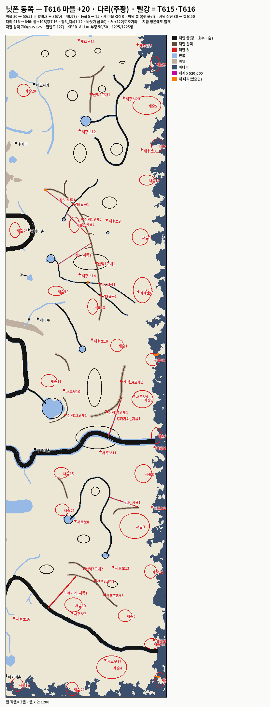

# T616 — 닛폰 동쪽 마을 · 다리 · 자잘 광맥 수 (세션5 · 2026-10-04 · T615 추신 뒤 같은 가지 · `[승인 대기 · T616]` · 정본 무변)

**한 줄 답:** 마을 **+20**(30 → 50 · 동쪽 5 → 25 · 필요 상한 **50**) · 다리 **+230**(416 → 646 · 동쪽 +108 · 그중 재민 지형 몫 28) · 자잘 광맥 **700**(p95 125 ≤ 한반도 127) · 시딩 전수 **50/50** · 교역 1,225/1,225쌍.

- 바탕: T615 판(`_terrain/editor-work_재민_v2_T615.json` — 재민 ○ 전 · T615 추신 "바로 이어서"). 재민 손질본이 오면 같은 기계를 다시 돌린다.
- 자: 해안 b(지금 main 기본 · 닛폰 이동 0) · T524 · 한반도는 같은 자로 다시 잰 판(뭍 867.4만셀).

## ① 마을 수 — 51 × 닛폰 뭍 ÷ 한반도 뭍

- 51 × 849.8만 ÷ 867.4만 = **49.97 → 50**(바다 띠 밖 셀 · T615 판 · PM 첫 눈 표 수 868 · 850 으로도 49.9). 지금 30 → **+20 · 전부 동쪽**.
- 자리 = T550 마을 후보 기계(`t550-villages.py` — 닛폰 30 을 뽑은 그 기계 · 수만 `--target 50` · 새 것은 `--min-x 40000` = 동쪽) → T596 계획기(`plan-villages-reset.js` · 겹침 0 · 마당 물 0).
  - 기계 규칙 그대로: 민물 걸음 ≤ 한반도 p50(85셀) · 후보끼리 ≥ 한반도 최근접 p80(10,770px) · 가장 먼 점 먼저 · 꼴 = 광맥 p95 안 → mining · 큰 강 · 바다 p50 안 → riverside · 숲 p50 안 → forest · 나머지 plain.
  - 계획기: 새 20곳끼리 · 옛 것과 겹침 **0**. 마당이 물에 걸린 셋만 옮겼다(새후보1 32.1셀 · 새후보19 14.1셀 · 새후보8 10셀). 옛 30곳의 옮김(후지다 ↔ 이즈이 겹침 · 마당 어김 9곳)은 T596 몫이라 안 옮겼다(표만 — T610 과 같다).
  - 개울은 지형 굽기 뒤 다시 굽는 것이라 계획기에 빈 판을 줬다(`--streams nippon=<0>`).

| 새 마을 | 꼴 | 셀 | 땅 점수 | 옮김 |
|---|---|---|---:|---:|
| 새후보1 | riverside | (2111, 3710) | 2.47 | 32.1 |
| 새후보2 | riverside | (2098, 2894) | 3.20 | 0 |
| 새후보3 | riverside | (2035, 702) | 1.83 | 0 |
| 새후보4 | forest | (1988, 2211) | 3.08 | 0 |
| 새후보5 | riverside | (2009, 57) | 1.97 | 0 |
| 새후보6 | plain | (2014, 1574) | 2.51 | 0 |
| 새후보7 | riverside | (1607, 3543) | 2.33 | 0 |
| 새후보8 | forest | (1626, 2979) | 2.79 | 10 |
| 새후보9 | forest | (1820, 1133) | 1.90 | 0 |
| 새후보10 | forest | (1558, 2178) | 1.90 | 0 |
| 새후보11 | forest | (1781, 2554) | 2.86 | 0 |
| 새후보12 | forest | (1654, 584) | 2.18 | 0 |
| 새후보13 | forest | (1859, 3262) | 1.63 | 0 |
| 새후보14 | forest | (1654, 1468) | 3.73 | 0 |
| 새후보15 | forest | (1647, 30) | 1.56 | 0 |
| 새후보16 | forest | (1251, 3575) | 2.74 | 0 |
| 새후보17 | forest | (1811, 3834) | 2.84 | 0 |
| 새후보18 | forest | (1729, 1868) | 1.53 | 0 |
| 새후보19 | riverside | (2112, 2527) | 2.59 | 14.1 |
| 새후보20 | riverside | (1925, 383) | 2.50 | 0 |

- 꼴: riverside 7 · forest 12 · plain 1 · **mining 0** — 동쪽에 대 · 중 · 소 광맥이 없어서(광맥 걸음 > 한반도 p95). 이름은 기계 이름(새후보N) 그대로 — 재민 몫.
- 땅 점수(식량 하한 `_land`)는 20곳 다 0 보다 크다(하한 통과).
- ⚠새후보6 은 T615 새숲6 안에 선다(마을 기계는 숲을 막지 않는다 · 숲이 먼저 놓였다). 서버는 마을 칸 나무를 걷는다(`clearTreesInCells`) — 재민이 볼 자리.
- **시딩 상한**: `villageMax` 30 이 모자란다 → **필요 50**(바꾸지 않았다 · 재민 판정 칸). 정본에 `seedAllVillages` 를 켜면 50 이 선다(아래 부팅).
- T524(T616 판 · 다리 416): 후보 50 다 섬(본토) · 쌍 1,225 · 갇힘 = 바닷가 섬뿐.

## ② 다리 — 있는 규칙(`t550-bridges.js` → 계획기 v2 고정점 · `T580_EMPTY_MIN=1000` · 그다음 `--no-canyon`)

| 판 | 더한 셀 | 어디 | 무엇을 건너나 |
|---|---:|---|---|
| ⓐ 협곡 있음 | 80 | 동 · 바닷가 섬 둘(1,972 · 1,244셀 · 셀 x 2115~2138) | 바다 띠 |
| ⓑ 협곡 없는 셈(코스 격자) | 16 | 동 · (1702, 1515~1522) | **강7 — ⓪ 의 갇힌 덩이(2,599셀)를 잇는다**(T615 추신 "반드시") |
| | 12 | 동 · (1441~1446, 951) | 강6_지류1(T615) |
| | 122 | **서** · (458~500, 2678~2753) | 토오가와 · 아카후유가와 |
| 합 | **230** | 416 → **646** | |

- 바닷가 섬 80 · 서쪽 122 는 **재민 지형과 무관**하다 — 같은 기계를 지금 정본(재민 지형 없음 · 해안 b)에 돌려도 202셀(섬 80 + 토오가와 122)이 나온다. 해안 b 가 기본이 된 뒤(T604 추신3) 생긴 몫으로 보인다 — 정본 다리 단계(T601 굽기)에서 같이 들어갈 것.
- 재민 지형 몫은 **28셀**(강7 16 · 강6_지류1 12).
- 강 길이당 다리: 한반도 836셀 ÷ 강 30,012셀 = **27.9/천셀** · 닛폰 동쪽 164셀(옛 56 + 새 108) ÷ 10,337셀 = **15.9/천셀**(바닷가 섬 다리 빼면 8.1).
- 작업 파일 `_terrain/nippon_다리_v2.json`(flat 646 · zone-config `nippon.bridges` 자리 그대로).

## ③ 자잘 광맥 수 — T610 의 자(한반도 p95 127 을 내는 가장 작은 수 · 50 걸음)

| 자잘 | p50 | p95 | p99 |
|---:|---:|---:|---:|
| 600 | 52 | 136 | 184 |
| 650 | 50 | 131 | 179 |
| **700** | 47 | **125** | 172 |
| 750 | 45 | 120 | 165 |
| 850 | 42 | 112 | 159 |
| 900 | 40 | 107 | 148 |
| 950 | 39 | 105 | 144 |
| 1,000 | 38 | 103 | 143 |

- **700**(T610 지금 판 1,000 · 안2 950 → 재민 지형 + T615 위에서 700). 띠 위 0 · 동쪽에 305.
  - 줄어든 까닭: 계획기는 소외(물 · 숲 180셀 밖) 구역에 몫을 2.5배 준다 — 재민 지형 + T615 지류 · 숲이 동쪽 소외를 거의 지워서 자잘이 존 전체에 고르게 퍼진다.
- 작업 파일 `_terrain/nippon_광맥_v2.json` — T616 판 닛폰 존 절 + 자잘 700(광종 칸 비움 · `T549_PLAN` 으로 바로 얹힌다). 적재 한 줄: `node scripts/t586-minor-ores.js --count 700 --apply`(지형 · 마을 굽기 뒤 · 같은 계획기 · 결정론).

## 시딩 전수 판 — `SEED_ALL=1 node scripts/test-nippon-boot.js`

- T616 판(지형 · 마을 50 · 다리 646 을 worktree 사본에만 얹음) · **42/0** · 시딩 **50/50** · 교역 BFS 1,225쌍 · 도달 **1,225/1,225** · 불능 0 · 다리구제 49.

- 그림: `산그림/T616_닛폰동쪽_마을다리.png` = `문서/T616_닛폰동쪽_마을다리.png` — 빨강 = T615 · T616 이 더한 것 · 주황 = 새 다리.
- 작업 파일: `_terrain/editor-work_재민_v2_T616.json` — T615 작업 파일 + 새 마을 20(월드 좌표 · 재민 줄 무변).

## 자

- `scripts/t550-villages.py` 손잡이 둘(`--target` · `--min-x` · 없으면 종전 그대로).
- `scripts/t615-png.py --bridges` — 다리 칸.

## PM 몫

1. 재민 눈: 새 마을 20 자리 · 이름(새후보N) · 새후보6(숲 안).
2. 판정: 시딩 상한 50(`villageMax` 50 또는 `seedAllVillages`).
3. 정본 다리 단계: 646(재민 지형 몫 28 · 해안 b 몫 202).
4. 자잘 700 — 대 · 중 · 소 다시 굽기(T574 추신4) 뒤 다시 잰다.
