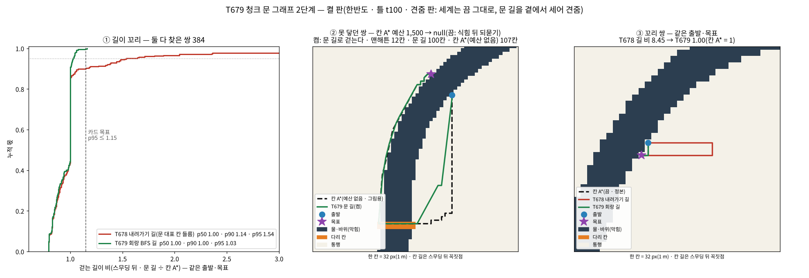

# 보고 — T679: 청크 문 그래프 2단계 — 길 꼬리 줄이기 · 표 상한 · 켤 판

**한 줄 답:** 걷는 길이 비(문 ÷ 칸 A\* · 같은 쌍) **p95 1.77 → 1.03**(p50 1.00 · p90 1.00 · p99 1.06 · 최대 1.16). 칸 길을 문 대표 칸 내려가기에서 **회랑 BFS** 로 바꿨다.
- 같은 판 같은 쌍의 T678 길은 p95 1.54 였다(새 틀). 1.15 넘는 쌍: 38 → 1.
- 켬 → 주민 A\* **예산 실패 1,101 / 1,086 → 5 / 5**. 남은 것은 표가 아직 없는 청크라 종전 A\* 로 간 물음이다.
- **한 방 최대 15.5 / 16.7 → 7.8 / 6.7 ms**. 이 최대는 그 남은 A\* 다. 문 길 물음 한 방은 최대 0.64 / 1.1 ms(c-on 판 1.96 ms)다.
- **사람당 A\* µs**(`--astar` 없는 판): 낮 0.459 → **0.278** · 밤 0.598 → **0.244**.
- **표 상한** = 마을 수 × 묻기 창 청크 수 = 51 × 25 = **1,275 청크**(≈12.6 MB). 실측 물은 청크는 692~742(7.1~7.3 MB)라 이 판에선 버림 0 이다. LRU 는 하네스 ⑥ 이 문다.
- **첫 짓기**: 짓는 틱 한 조각 평균 ≈0.26 ms · 최대 3.1 / **5.45** / 3.8 ms. ≤4.65 가 **한 번 깨졌다**(on-2).
  - 짓는 틱과 안 짓는 틱의 틱 전체 p99 는 24.3 / 23.8 ↔ 23.4 / 23.1 ms 로 갈리지 않는다.
- **켤 판 그림**: `문서/T679_켤판.png`(① 길이 꼬리 누적 분포 · ② 못 닿던 쌍 지도 · ③ 꼬리 쌍 지도).
  - 못 닿던 쌍은 판마다 서로 다른 ≈22 쌍(마을·직업·목표)이다. 끔이면 ≈1,100번 되묻는다.
  - 켬이면 걷는다. 문 길 p50 102칸(T678 122칸) · 칸 A\*(예산 없음)의 ×0.93.

[승인 대기 · T679] · 가지 `batch/chunk-gates2-1009` = `09d68dc9`(내용 · 이 보고는 그 위 문서 커밋 하나) · 베이스 `e15680e`(main) · force 0 · 라이브 접속 0

* 제품:
  * `server/chunk-gates.js` — 회랑 BFS(`corridorPath`) · 종전 내려가기(`descendPath` · 견줌·안전망) · LRU(`opt.cap` · `evictOver`) · `windowChunks` · `busy`
  * `server/zone.js` — 손잡이 `T678_GATES` 그대로(끔 기본). 상한 주입 · 견줌 판 종전 길 같은 쌍 · 그림 표본 · 짓는 틱 관측(켬·견줌만)
  * 새 수 0(상한 = 마을 수 × 창 청크 수 · 창 = 반경 64 · 청크 32) · 판정 0 · **새 몸 필드 0**(`_t671Shape` 무변) · `sim/path-core.js` **0 글자**
* 설계: `설계/설계_청크_문_그래프.md` — §3-5(회랑 BFS) · §4(표 상한) · §5(T679 길이 표) · §6-5·6(했음).
* 그림: `scripts/t679-plot.py`(견줌 판 json → PNG) · `문서/T679_켤판.png`
* 하네스:
  * `test-chunk-gates` **23/0**(T678 14 → ②·⑤·⑥ 더함)
  * `test-move-soa` **262/0**
  * `test-body-fields` **7/0**
  * `test-route-persist` **56/0**(혼자 판 · 견줌 판과 겹쳐 돌린 첫 판은 ⑦d 루프 최대 682.1 > 681 ms 로 1 실패 — 시간 잡음)
  * lint **60/1**(= main · `e2e-mtcut` 이모지 · 이 카드 무관)
* 3시드: 랩 모듈이 쓰는 것은 커널(`sim/path-core.js`)뿐이고 이 카드는 0 글자 ⇒ **자명**.

---

## §0 자 · 판

* 자 = T670 ③ 그 자(`scripts/t646-anatomy.js run cap40 <tag> [--astar]`) · 주민 612 · 낮/밤 창 30초 × 6조각 · 관측자 1.
* 틀 = **오늘 main(`e15680e`)으로 새로 구운 t100**(`T368_ARMS=t100 scripts/t368-farm-day.js a`). T678 틀과 다르다(main 이 T661 켬 기본 등으로 바뀌었다).
* 판(혼자 판 · 차례대로 · 한 판 ≈23분):
  * 견줌(`T678_GATES=verify --astar`) — 세계는 끔 그대로, 문 길을 곁에서 세어 견준다. 같은 쌍의 칸 A\* · T678 길 · T679 길을 다 잰다.
  * `--astar` ABBA: 끔-1 · 켬-1 · 켬-2 · 끔-2 — 실패 수 · 한 방 최대.
  * `--astar` 없는 판: 끔 · 켬 — 사람당 µs(`--astar` 는 실패 물음을 예산 없이 다시 돌려 'astar' 칸을 부풀린다).

## §1 ① 꼬리 줄이기 — 회랑 BFS

* **무엇을 바꿨나:** 문 그래프(다익스트라)가 고른 길의 청크들(출발 · 문들 · 목표) = **회랑**이다. 그 위에서 지은 비트(통행 · 간선)만으로 출발 → 목표 **최단 칸 길**을 BFS 로 다시 찾는다.
  * 술어 부름 0 · 회랑 ≤ 창(25 청크). 실측 BFS 칸 수 평균 607~695 · 최대 3,817.
  * 문 대표 칸(구간 가운데)을 들르지 않는다. 구간 어느 짝으로든 건넌다.
  * 카드의 두 처방(① 건너기 칸 고르기 · ② 끝 두 청크 칸 A\* 다듬기)을 한 번에 갈음한다. 회랑 전체가 최단이므로 끝 청크 다듬기가 따로 필요 없고, 칸 A\*(술어 부름 · 예산)를 다시 부르지 않는다.
* 회랑이 못 찾으면 종전 내려가기로 간다(안전망 · 낡은 표가 엇갈린 판). **실측 0번**(네 판 전부 `corrFail` 0).

| 같은 쌍(견줌 판 · 낮 창 384쌍) | p50 | p90 | p95 | p99 | 최대 | 1.15 넘음 |
|---|---:|---:|---:|---:|---:|---:|
| T678 내려가기 길 ÷ 칸 A\* | 1.00 | 1.14 | 1.54 | 4.37 | 8.45 | 38 |
| **T679 회랑 길 ÷ 칸 A\*** | **1.00** | **1.00** | **1.03** | **1.06** | **1.16** | **1** |
| (T678 보고 · 옛 틀 446쌍) | 1.00 | 1.21 | 1.77 | 3.59 | 5.28 | — |

* 걷는 길이 = 스무딩 뒤 px(`computeNpcPath` 꼬리와 같은 스무딩 · 같은 술어 · 같은 길 앵커).
* T679 길이 칸 A\* 보다 짧은 쌍 170 · 같은 쌍 177 · 긴 쌍 35. 짧은 몫은 칸 A\* 의 개울 ×2 · 답압 길 선호가 길을 돌리는 몫이다. 문 길은 칸 비용 1 이다(설계 §6-3 · 회부).
* 남은 꼬리(최대 1.16)는 청크 차례를 여전히 대표 칸 비용으로 고르는 몫(회랑 밖 지름길을 못 봄)과 스무딩 차로 읽힌다(추정).
* 합성 세계(`test-chunk-gates ②`): 회랑 길 ÷ 창 최단 p50 1 · p95 1 · 최대 1.087. 같은 쌍 T678 길은 p95 1.148 · 최대 2.263.
* 견줌 판 물음 805: 둘 다 찾음 384 · **A\* 만 찾음 0** · 문만 찾음 377(낮 141 · 밤 236) · 둘 다 못 찾음 41 · 모름 3.

## §2 ③ 켤 판 — 실패 · 한 방 최대(`--astar` ABBA)

| 판 | 예산 실패 | 그 시간 합 | 예산 없이 닿음 | 서로 다른 (마을·직업·목표) | 한 방 최대 | 예산 실패 p50 |
|---|---:|---:|---:|---:|---:|---:|
| 끔-1 | 1,101 | 5,440 ms | 1,101/1,101 | 22 | **15.5 ms** | 4.5 ms |
| 켬-1 | **5** | 29 ms | 5/5 | 5 | **7.8 ms** | 5.8 ms |
| 켬-2 | **5** | 27 ms | 5/5 | 5 | **6.7 ms** | 5.8 ms |
| 끔-2 | 1,086 | 5,341 ms | 1,086/1,086 | 22 | **16.7 ms** | 4.4 ms |

* 켬 판의 남은 5번은 문 그래프가 **모름**(창 안 청크 표가 아직 없음)이라 종전 칸 A\* 로 간 물음이다. 낮 창 `fallback` 이 8 / 6 이다. T678 켬은 12 / 16 이었다.
* 끔의 1,100번은 22 쌍이 식힘(2초)마다 되묻는 것이다. 대부분 어부의 물가 배회 목표가 강 건너편에 떨어진 것이다(그림 ②).
* 문 그래프 물음(켬 낮 창): 492 / 562번. 문 길 462 / 462 · 즉시 null 22 / 94 · 모름 8 / 6이다.
  * 한 번 평균 0.16 / 0.14 ms · 최대 **0.64 / 1.1 ms**(c-on 판 1.96 ms). 못 닿음 판정(unreach) 0.
* 막힘(dead · 출발·목표 칸 막힘 · 0 ms) 685~1,156 은 끔·켬 같은 규칙으로 null 이다(판마다 수가 다른 것은 세계 흐름 차).

## §3 ③ 사람당 µs(`--astar` 없는 판 · 한 판씩)

| 칸 | 끔 낮 | 켬 낮 | 끔 밤 | 켬 밤 |
|---|---:|---:|---:|---:|
| **'astar'**(칸 A\* + 문 길 물음) | **0.459** | **0.278** | **0.598** | **0.244** |
| 　실패 갈래(횟수 · 시간 합) | 347 · 593 ms | 141 · 1.7 ms | 231 · 1,212 ms | 156 · 3.3 ms |
| 　찾음 갈래(횟수 · 시간 합) | 469 · 161 ms | 431 · 102 ms | 4 · 0.8 ms | 3 · 1.2 ms |
| 일 훅(문 짓기·서명 쓸기가 여기) | 0.042 | 0.109 | 0.046 | 0.078 |
| 틱 p50 / p95(ms) | 5.40 / 8.84 | 5.86 / 8.29 | 5.50 / 8.91 | 5.28 / 7.64 |
| 틱 전체(µs/사람) | 9.61 | 10.10 | 9.90 | 9.30 |

* 켬 실패 갈래는 거의 다 **즉시 null**(막힘 · 반경 밖 · 1.7 / 3.3 ms 합)이다.
* 이 카드 몫은 'astar' −0.18 / −0.35 와 일 훅 +0.07 / +0.03 이다.
* 틱 전체 줄(낮 +0.5 · 밤 −0.6)은 한 판씩이라 잡음이 섞인다. 낮의 오름은 결정 문 · 막힘 · gc 칸에 흩어져 있다. **이 카드 몫으로 읽지 않는다.**
  * 다만 켬이면 못 닿던 ≈22 사람이 서 있는 대신 걷는다. 그 걸음 몫은 켬 쪽에 실제로 든다.

## §4 ② 표 상한 · 첫 짓기

| 값 | 켬-1 | 켬-2 | c-on |
|---|---:|---:|---:|
| 지은 청크(밤 창 끝) | 723 | 742 | 717 |
| 문 | 2,846 | 2,921 | 2,819 |
| 메모리 | 7.14 MB | 7.33 MB | 7.08 MB |
| 상한(51 마을 × 25) · 버림 | 1,275 · 0 | 1,275 · 0 | 1,275 · 0 |
| 짓기 시간 누계 | 630 ms | 642 ms | 621 ms |
| 짓는 틱 수 · 조각 평균 | 2,414 · 0.26 ms | 2,479 · 0.26 ms | 2,399 · 0.26 ms |
| **조각 한 틱 최대** | 3.12 ms | **5.45 ms** | 3.79 ms |
| 짓는 틱 전체 p50 / p99 / 최대 | 5.84 / 24.3 / 55.6 | 5.62 / 23.8 / 49.0 | 5.96 / 23.9 / 35.2 |
| 안 짓는 틱(부팅 뒤 10분) p50 / p99 / 최대 | 5.75 / 23.4 / 156 | 5.54 / 23.1 / 132 | 5.79 / 23.3 / 171 |
| 다시 짓기 · 서명 무효 · 판 무효 | 0 · 0 · 0 | 0 · 0 · 0 | 0 · 0 · 0 |

* **상한** = 마을 수 × 주민 묻기 창이 걸치는 청크 수((2⌈64/32⌉+1)² = 25)다.
  * 한 마을 주민이 한 창 안에서 묻는다면 그 합이 다 든다. 실측 마을당 ≈14 청크라 이 판에선 버림이 0 이다.
  * 상한은 `clientVillages()` 길이를 그때그때 읽는다. 마을이 늘면 따라 는다 · 없으면 창 하나.
* LRU(`test-chunk-gates ⑥`):
  * 상한 30 으로 400 물음을 돌리면 표 수 최대 30 · 버림 1,355 · 버린 청크를 다시 물으면 unknown 264 다.
  * 다시 지은 뒤 답 = 창 BFS 400/400.
  * 최근에 물은 창은 남고 오래된 창이 버려진다.
* **첫 짓기 ≤ 4.65 ms 는 그대로가 아니다.** on-2 에서 조각 한 틱 최대가 5.45 ms 로 한 번 넘었다.
  * 조각 평균은 0.26 ms 다(1,500 부름 ≈ 0.17 µs/부름). 그래서 최대 3~5 ms 는 그 틱의 GC·할당 몫으로 읽힌다(추정 · 조각별 분포는 안 남겼다).
  * 짓는 틱과 안 짓는 틱의 틱 전체 분포(p50 · p99)는 갈리지 않는다. 짓는 틱의 최대(35~56 ms)는 안 짓는 틱의 최대(132~171 ms · 부팅 몫)보다 작다.

## §5 켤 판 — 재민 판정용 한 장

* **① 길이 꼬리** — 같은 쌍에서 T678 길(빨강)은 p95 1.54 · 꼬리 8.45 였다. T679 회랑 길(초록)은 p95 1.03 · 최대 1.16 이다.
* **② 못 닿던 쌍** — 어부가 강가에서 배회 목표를 받았는데 그 칸이 강 건너편이다(맨해튼 12칸).
  * 끔: 칸 A\* 가 1,500칸 예산을 다 태우고 null → 식힘 2초 → 되묻기를 밤새 되풀이한다.
  * 켬: 다리로 돌아 문 길 100칸을 걷는다. 칸 A\*(예산 없음 · 그림용)는 107칸이다.
* **③ 꼬리 쌍** — 출발과 목표가 한 칸 옆이다. T678 은 문 대표 칸까지 다녀왔다(비 8.45). T679 는 바로 간다(1.00).
* 판정 칸(길이 달라지는 것):
  * (가) 못 닿던 ≈22 쌍이 **걷는다** — 끔은 서서 되묻는다.
  * (나) 칸 비용 1 이라 개울 ×2 · 길 선호를 안 탄다 — 칸 A\* 보다 짧은 쌍 44 %(170/384).
  * (다) 그 밖의 길이 꼬리는 p95 1.03 이다.

## 회부(판정 0 · 재민/PM 칸)

* ① **켬 기본 여부** — §5 (가)(나)가 판정 칸이다. 꼬리는 카드 목표(p95 ≤ 1.15) 안이다.
* ② 칸 비용(개울 ×2 · 길 선호)을 표에 넣기(설계 §6-3) — (나)를 줄인다. BFS → 다이얼 버킷이고, 문 표·회랑 둘 다다.
* ③ 조각 한 틱 최대 5.45 ms(한 번) — 조각별 분포를 남겨 GC 몫인지 가를지. 아니면 조각 예산을 그대로 둘지.
* ④ 남은 설계: 반경 밖 먼 길 · 생활권 안 전 쌍 · 역참조(설계 §6-1·2·4) · 이웃 존 유령 벽 서명.
* ⑤ 끔 = main 바이트는 코드로 자명하다. 새 갈래는 모두 `T678_ON` · `T678_VERIFY` · `_t678G`(끔이면 null) 뒤에 있다. 틱 끝 관측 한 줄도 `_t678G` 뒤다. 세계 바이트 견줌 판은 따로 안 돌렸다.
